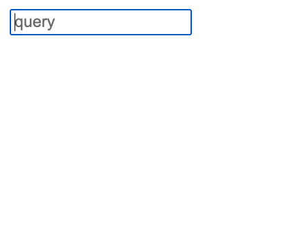
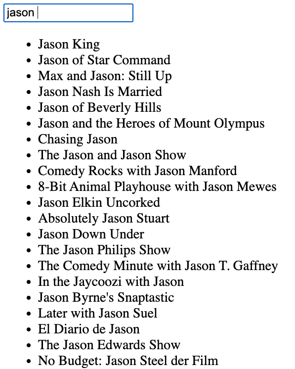

# A small flask app that utilizes Ninja2, Sqlite and Jquery.
## No style whatsoever, app queries the imdb database sample and returns matching values on the type.
## Designed for learning purposes.

